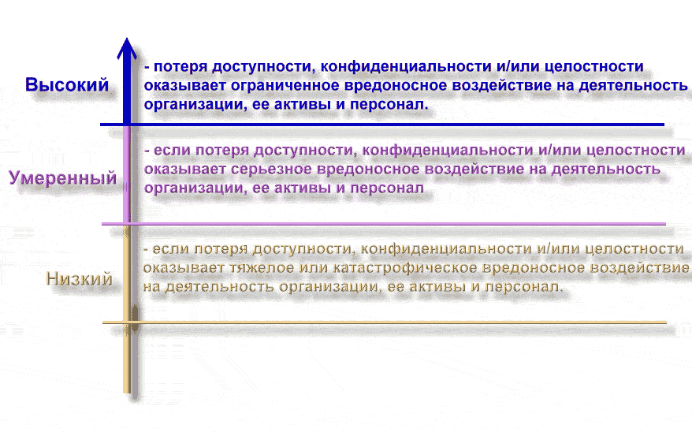
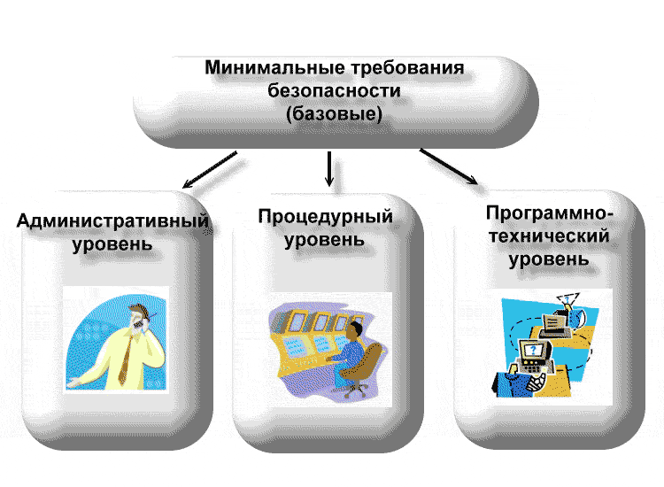
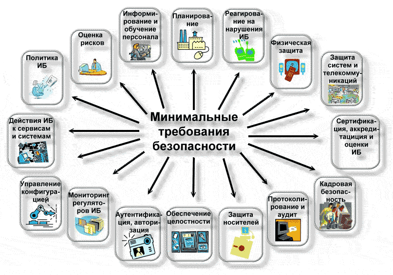

# ex
### Категорирование информации и информационных систем
 

Присвоение категорий безопасности информации и информационным системам производится на основе оценки ущерба, который может быть нанесен нарушениями безопасности. Подобные инциденты могут помешать организации в выполнении возложенной на нее миссии, скомпрометировать активы, поставить компанию в положение нарушителя действующего законодательства, создать угрозу повседневной деятельности, подвергнуть опасности персонал. Категории безопасности используются совместно с данными об уязвимостях и угрозах в процессе анализа рисков, которым подвержена организация.

 

##### Существуют три основных аспекта ИБ:

- доступность;
- конфиденциальность;
- целостность.
 

>Вообще говоря, нарушения ИБ могут затрагивать лишь часть этих аспектов, равно как и регуляторы безопасности могут быть специфичны для отдельных аспектов. Поэтому целесообразно оценивать возможный ущерб отдельно для нарушений доступности, конфиденциальности и целостности, а при необходимости можно получить интегральную оценку.

 

Размер ущерба удобно оценивать по трехуровневой шкале как низкий, умеренный или высокий.

Потенциальный ущерб для организации оценивается как низкий, если потеря доступности, конфиденциальности и/или целостности оказывает ограниченное вредоносное воздействие на деятельность организации, ее активы и персонал. 

##### Ограниченность вредоносного воздействия означает, что:

 

- организация остается способной выполнять возложенную на нее миссию, но эффективность основных функций оказывается заметно сниженной;
- активам организации наносится незначительный ущерб;
- организация несет незначительные финансовые потери;
персоналу наносится незначительный вред.
 

>Потенциальный ущерб для компании оценивается как умеренный, если потеря доступности, конфиденциальности и/или целостности оказывает серьезное вредоносное воздействие на деятельность организации, ее активы и персонал. 

##### Серьезность вредоносного воздействия означает, что:

 

- компания остается способной выполнять возложенную на нее миссию, но эффективность основных функций оказывается существенно сниженной;
- активам организации причиняется значительный ущерб;
- компания несет значительные финансовые потери;
- персоналу наносится значительный вред, не создающий угрозы жизни или здоровью.
 

>Потенциальный ущерб для организации оценивается как высокий, если потеря доступности, конфиденциальности и/или целостности оказывает тяжелое или катастрофически вредоносное воздействие на деятельность организации, ее активы и персонал.

##### Это означает, что:

- компания теряет способность выполнять все или некоторые из своих основных функций;
- активам организации причиняется крупный ущерб;
- организация несет крупные финансовые потери;
- персоналу наносится тяжелый или катастрофический вред, создающий возможную угрозу жизни или здоровью.
 

>Категорировать необходимо и пользовательскую, и системную информацию, представленную как в электронной форме, так и в виде "твердой" копии.

Открытая информация может не иметь категории конфиденциальности. Например, сведения, содержащиеся на общедоступном web-сервере организации, не имеют категории конфиденциальности, а их доступность и целостность оцениваются как умеренные.

 

При категорировании информационной системы принимаются во внимание категории хранимой, обрабатываемой и передаваемой средствами ИС информации, а также ценность активов самой ИС, т.е. берется максимум категорий по всем видам информации и активов. Для получения интегральной оценки следует взять максимум категорий по основным аспектам информационной безопасности.

 

### Минимальные (базовые) требования безопасности
 

Минимальные (базовые) требования безопасности формулируются в общем виде, без учета категории, присвоенной ИС. Они задают базовый уровень информационной безопасности, им должны удовлетворять все информационные системы. Результаты категорирования важны при выборе регуляторов безопасности, обеспечивающих выполнение требований, сформулированных на основе анализа рисков.

Минимальные требования безопасности охватывают административный, процедурный и программно-технический уровни ИБ и формулируются следующим образом.

Организация должна разработать, документировать и обнародовать официальную политику безопасности и формальные процедуры, направленные на выполнение приведенных ниже требований, и обеспечить эффективную реализацию политики и процедур.
В компании необходимо периодически производить оценку рисков, включая оценку угроз миссии, функционированию, имиджу и репутации организации, ее активам и персоналу. Эти угрозы являются следствием эксплуатации ИС и осуществляемых при этом обработки, хранения и передачи данных.
##### Применительно к закупке систем и сервисов в компании необходимо:
 

- выделить достаточный объем ресурсов для адекватной защиты ИС;
- при разработке систем учитывать требования ИБ;
- ограничивать использование и установку программного обеспечения;
- обеспечить выделение внешними поставщиками услуг достаточных ресурсов для защиты информации, приложений и/или сервисов.

##### В области сертификации, аккредитации и оценки безопасности в организации следует проводить:
 

- постоянный мониторинг регуляторов безопасности, чтобы иметь доверие к их эффективности;
- периодическую оценку регуляторов безопасности, применяемых в ИС, чтобы контролировать их эффективность;
- разработку и претворение в жизнь плана действий по устранению недостатков и уменьшению или устранению уязвимостей в ИС;
- авторизацию введения в эксплуатацию ИС и установление соединений с другими информационными системами.

##### В области кадровой безопасности необходимо:
 

- обеспечить надежность (доверенность) должностных лиц, занимающих ответственные посты, а также соответствие этих лиц предъявляемым к данным должностям требованиям безопасности;
- обеспечить защиту информации и информационной системы при проведении дисциплинарных акций, таких как увольнение или перемещение сотрудников;
- применять соответствующие официальные санкции к нарушителям политики и процедур безопасности.

##### Организация должна обеспечить информирование и обучение сотрудников:
 

- чтобы руководители и пользователи ИС знали о рисках, связанных с их деятельностью, и о соответствующих законах, нормативных актах, руководящих документах, стандартах, инструкциях и т.п.;
- чтобы персонал имел должную практическую подготовку для выполнения обязанностей, связанных с информационной безопасностью.

В области планирования необходимо разработать, документировать, периодически изменять и реализовать планы обеспечения безопасности ИС, описывающие регуляторы безопасности (имеющиеся и планируемые) и правила поведения персонала, имеющего доступ к ИС.
С целью планирования бесперебойной работы в компании следует установить, поддерживать и эффективно реализовать планы реагирования на аварийные ситуации, резервного копирования, восстановления после аварий, чтобы обеспечить доступность критичных информационных ресурсов и непрерывность функционирования в аварийных ситуациях.
##### В плане реагирования на нарушения информационной безопасности организация должна:
 

- создать действующую структуру для реагирования на инциденты, имея в виду адекватные подготовительные мероприятия, выявление, анализ и локализацию нарушений, восстановление после инцидентов и обслуживание обращений пользователей;
- обеспечить прослеживание, документирование и сообщение об инцидентах соответствующим должностным лицам организации и уполномоченным органам.

##### С целью физической защиты организация должна:
 

- предоставлять физический доступ к ИС, оборудованию, в производственные помещения только авторизованному персоналу;
- физически защищать оборудование и поддерживающую инфраструктуру ИС;
- обеспечить должные технические условия для функционирования ИС;
- защищать ИС от угроз со стороны окружающей среды;
- обеспечить контроль условий, в которых функционирует ИС;
- обеспечить управление доступом, предоставив доступ к активам ИС только авторизованным пользователям, процессам, действующим от имени этих пользователей, а также устройствам (включая другие ИС) для выполнения разрешенных пользователям транзакций и функций.

##### Для обеспечения протоколирования и аудита необходимо:
 

- создавать, защищать и поддерживать регистрационные журналы, позволяющие отслеживать, анализировать, расследовать и готовить отчеты о незаконной, несанкционированной или ненадлежащей активности;
- обеспечить прослеживаемость действий в ИС с точностью до пользователя (подотчетность пользователей).

##### В плане управления конфигурацией в компании следует:
 

- установить и поддерживать базовые конфигурации;
- иметь опись (карту) ИС, актуализируемую с учетом жизненного цикла, в которую входят аппаратура, программное обеспечение и документация;
- установить и обеспечить практическое применение настроек для конфигурирования средств безопасности в продуктах, входящих в ИС.

>В области идентификации и аутентификации необходимо обеспечить идентификацию и аутентификацию пользователей ИС, процессов, действующих от имени пользователей, а также устройств как необходимое условие предоставления доступа к ИС.
 
##### Применительно к сопровождению:
 

- осуществлять периодическое и своевременное обслуживание ИС;
- обеспечить эффективные регуляторы для средств, методов, механизмов и персонала, осуществляющих сопровождение.

##### Для защиты носителей:
 

- защищать носители данных как цифровые, так и бумажные;
- предоставлять доступ к данным на носителях только авторизованным пользователям;
- санировать или уничтожать носители перед выводом из эксплуатации или перед передачей для повторного использования.

##### С целью защиты систем и коммуникаций:
 

- отслеживать, контролировать и защищать коммуникации (то есть передаваемые и принимаемые данные) на внешних и ключевых внутренних границах ИС;
- применять архитектурные и аппаратно-программные подходы, повышающие действующий уровень информационной безопасности ИС.

##### Для обеспечения целостности систем и данных:
 

- своевременно идентифицировать дефекты ИС и данных, докладывать о них и исправлять;
- защищать ИС от вредоносного программного обеспечения;
- отслеживать сигналы о нарушениях безопасности и сообщения о новых угрозах для информационной системы и должным образом реагировать на них.